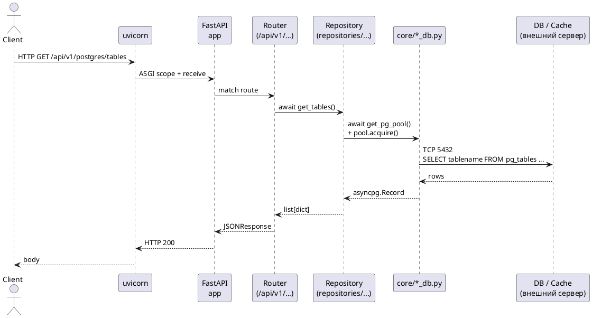
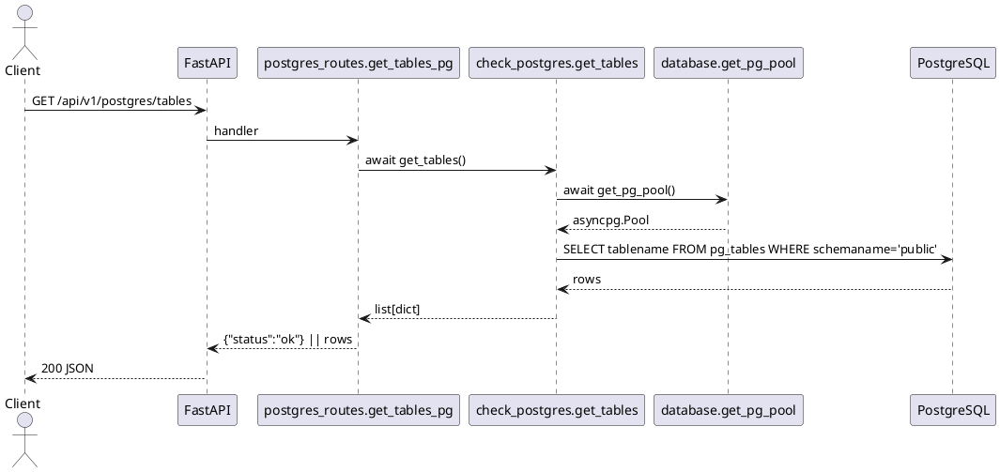
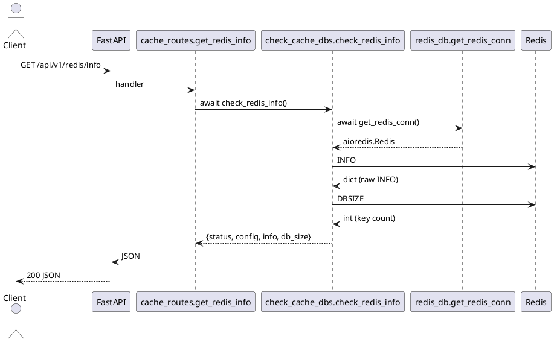
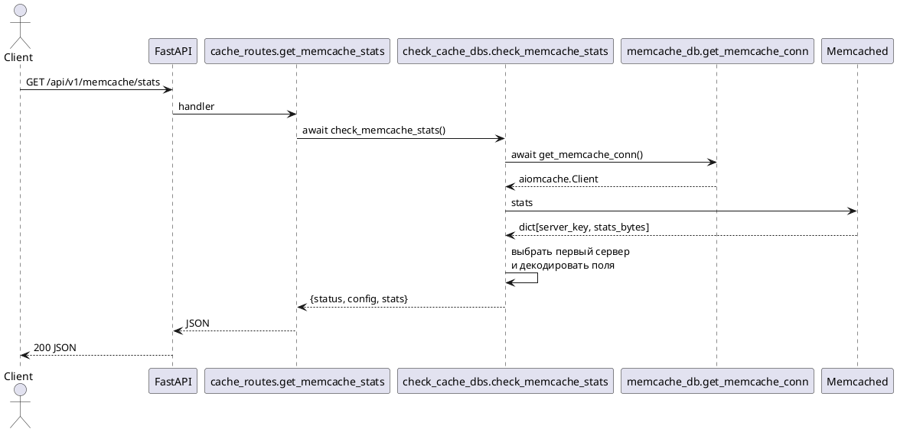
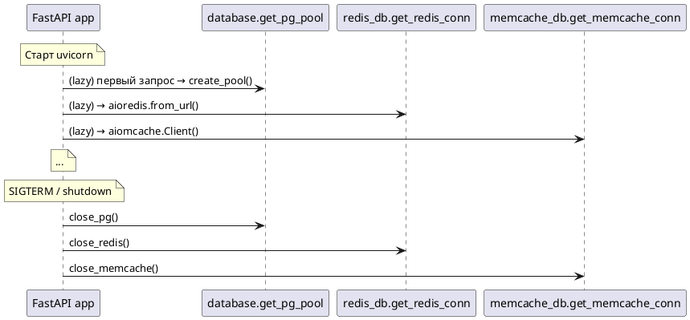

# Потоки данных

Ниже — sequence-диаграммы для трёх ключевых сценариев: чтение метрик
PostgreSQL, Redis и Memcached. Все эндпоинты идемпотентны, никаких
побочных эффектов не вызывают.

## Общий путь HTTP-запроса

## PostgreSQL: список таблиц

## Redis: `INFO` + `DBSIZE`

## Memcached: `stats`

## Жизненный цикл соединений

Все три клиента — module-level singletons, инициализируются при первом
обращении и закрываются на событии `shutdown`.
