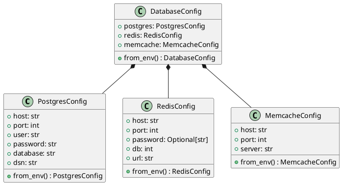
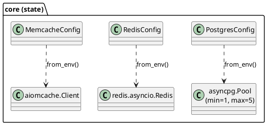
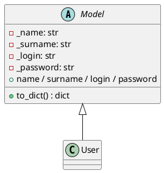

# Модель данных

Midnight — read-only: он не хранит собственных данных, только читает
метрики из управляемых хранилищ. Состояние приложения — это три
долгоживущих клиента + конфигурация.

## Конфигурация приложения

В рантайме используются три singleton-клиента, инициализируемые
лениво при первом обращении:

## Какие данные читаются

### PostgreSQL

| Источник | Эндпоинт | Назначение |
|---|---|---|
| `version()` | `/postgres/check-version` | Строка версии сервера |
| `pg_stat_activity` | `/postgres/requests`, `/postgres/transactions` | Активные сессии и запросы |
| `pg_user` | `/postgres/users` | Учётные записи |
| `pg_tables` | `/postgres/tables` | Таблицы `public` |
| `pg_database` | `/postgres/databases` | Список БД |
| `pg_indexes` + `information_schema.columns` | `/postgres/indexes`, `/postgres/indexes/{table_name}` | Индексы схемы/таблицы |
| `pg_available_extensions` | `/postgres/extensions` | Доступные расширения |
| `pg_views` | `/postgres/views` | Представления |
| `pg_matviews` | `/postgres/materialized_views` | Мат. представления |

### Redis

`INFO` (все секции) + `DBSIZE`. Извлекаемые поля:

- `redis_version`
- `uptime_in_seconds`
- `connected_clients`
- `used_memory_human`
- `total_connections_received`
- `keyspace_hits`, `keyspace_misses`

### Memcached

`stats` — полный набор ключей, среди которых интересуют:

`pid`, `uptime`, `curr_items`, `total_items`,
`curr_connections`, `total_connections`, `bytes`,
`get_hits`, `get_misses`, `bytes_read`, `bytes_written`.

## Доменные модели (`src/models/`)

> ⚠️ **Эти модели нигде не используются API.** Они лежат как заготовка
> и в текущей версии проекта к эндпоинтам не подключены. Удалять
> пока не рекомендуется — возможно, это начало ORM-слоя, который
> планируется добавить.
