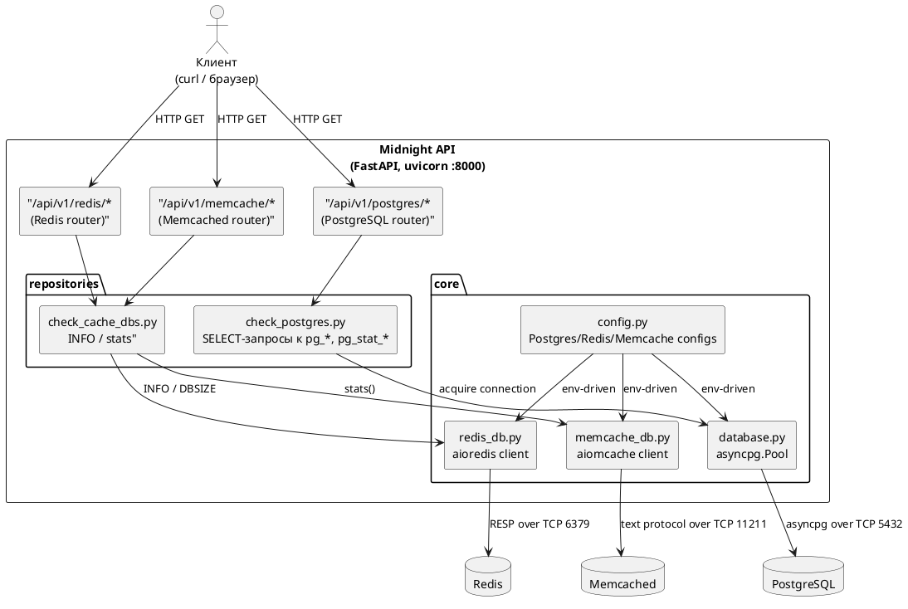

# Обзор проекта

## Назначение

**Midnight** — асинхронный HTTP-API для сбора и выдачи операционной статистики
по четырём типам хранилищ:

- **PostgreSQL** — версия, активные сессии, таблицы/индексы/представления, пользователи и т.д.
- **Redis** — `INFO`, размер БД, потребление памяти, uptime.
- **Memcached** — `stats`, ключи, соединения, использование памяти.
- **MongoDB** — `serverStatus`, версия, соединения, uptime.

Целевая аудитория — разработчики и SRE, которым нужен быстрый «глазок» в
работающие инстансы без захода в psql/redis-cli напрямую.

## Стек

| Слой | Технология |
|---|---|
| HTTP-фреймворк | [FastAPI](https://fastapi.tiangolo.com/) 0.139 |
| ASGI-сервер | [Uvicorn](https://www.uvicorn.org/) |
| Драйвер PostgreSQL | [asyncpg](https://magicstack.github.io/asyncpg/) (пул 1–5) |
| Драйвер Redis | [redis-py asyncio](https://redis.readthedocs.io/) (`redis.asyncio`) |
| Драйвер Memcached | [aiomcache](https://aiomcache.readthedocs.io/) |
| Драйвер MongoDB | [motor](https://motor.readthedocs.io/) (`AsyncIOMotorClient`) |
| Веб-дашборд | встроенный HTML+JS (WebSocket `/ws/stats`) |
| Миграции | [Alembic](https://alembic.sqlalchemy.org/) (подключён, миграций нет) |
| Python | ≥ 3.13 |
| Управление зависимостями | [uv](https://github.com/astral-sh/uv) |

## Верхнеуровневая архитектура



## Структура каталогов

```
Midnight/
├── alembic.ini                       # Конфиг Alembic (миграций пока нет)
├── pyproject.toml                    # uv-проект: зависимости + скрипты
├── src/
│   ├── .env                          # Локальные переменные окружения (не в git)
│   ├── main.py                       # FastAPI app, lifespan, /ws/stats, дашборд
│   ├── templates/
│   │   └── index.html                # Веб-дашборд мониторинга (HTML+JS)
│   ├── api/
│   │   └── v1/
│   │       ├── __init__.py           # Аггрегирующий router
│   │       ├── postgres_routes.py    # /postgres/*
│   │       ├── cache_routes.py       # /redis/* и /memcache/*
│   │       └── mongo_routes.py       # /mongo/*
│   ├── core/
│   │   ├── config.py                 # Датаклассы конфигов + чтение .env
│   │   ├── database.py               # Пул PostgreSQL (asyncpg)
│   │   ├── redis_db.py               # Клиент Redis (redis.asyncio)
│   │   ├── memcache_db.py            # Клиент Memcached (aiomcache)
│   │   └── mongo_db.py               # Клиент MongoDB (motor)
│   ├── repositories/
│   │   ├── check_postgres.py         # SELECT-функции к системным каталогам PG
│   │   ├── check_cache_dbs.py        # Сборщики статистики Redis/Memcached
│   │   └── check_mongo.py            # Сборщики статистики MongoDB
│   ├── services/
│   │   └── stats_collector.py        # Единый сборщик для WebSocket-дашборда
│   ├── models/                       # Заготовки моделей (User, Model) — не используются API
│   ├── mappers/                      # Заготовка слоя мапперов — пустая
│   └── utills/                       # Вспомогательное (пустое содержимое)
├── migrations/                       # Alembic env.py + шаблон
├── tests/                            # Заготовка (пустая)
└── docs/                             # ← эта документация
```

## Запуск

```bash
# development с авто-перезагрузкой
uv run dev

# production
uv run start
```

После запуска:

- Корневой `GET /` отдаёт веб-дашборд мониторинга (данные — через `/ws/stats`).
- Swagger UI: `http://localhost:8000/docs`.
- ReDoc: `http://localhost:8000/redoc`.

## Переменные окружения

Полный список — в [api.md § Конфигурация](api.md#конфигурация).
